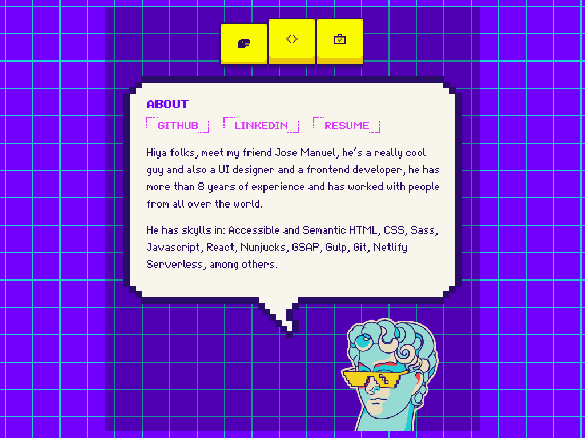

# Jose Manuel Arellanes - Portfolio

This is the code for my personal portfolio.

## Table of contents

- [Overview](#overview)
  - [Features](#features)
  - [Screenshot](#screenshot)
  - [Links](#links)
  - [Built with](#built-with)
- [Author](#author)

## Overview

### Features

- Accessible menu tab navigation,
- About section with links to my Github, Linkedin and resume,
- Portfolio highlight section with my best React project and two of my most recents freelance professional works, and
- Contact section with button to send me a email and a link to my twitter account.

### Screenshot

### Links

- Repository URL: [Github repository](https://github.com/jmarellanes/jm__portfolio-pixel)
- Live Site URL: [José Manuel Arellanes - My Portfolio](https://josearellanes.me/)

### Built with

- Semantic HTML5 compiled from Nunjucks
- Accessible features
- CSS with BEM methodology
- Sass
- Flexbox
- CSS Grid
- Gulp
- Vanilla JavaScript

## Author

- [Portfolio](http://www.josearellanes.me/)
- [Linkedin](https://www.linkedin.com/in/jmarellanes/)
- [Github](https://www.github.com/jmarellanes)
- [@jmarellanes](https://twitter.com/jmarellanes)
